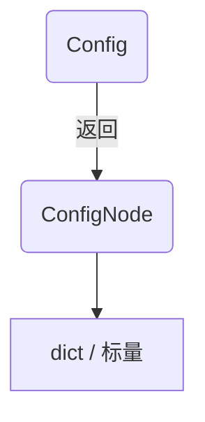

# confull – 面向 AI 的集成指南

本文档介绍了 `confull` 库的功能和用法,适用于 AI 阅读使用。

## 1. 总览

* **Config** – 入口类，支持 *json / toml / yaml / ini / xml*。
  * 构造: `Config(data: dict | None = None, file: str = "config", way="toml", replace=False, auto_save=True, pwd: str | None = None, process_safe=False)`
* **ConfigNode** – 嵌套节点包装，属性访问 / 下标访问均可。

## 2. 核心能力

1. **点路径读写** – `cfg.write('a.b.c', 1)` / `cfg.read('a.b.c')`
2. **自动补全** – `cfg.app.version = '1.0'` 时自动创建缺失层级
3. **数据优先** – 当键名与内部方法冲突(`to_dict`, `data`)时返回数据值
4. **自动保存** – 任何变更立即持久化 (除非 `auto_save=False`)
5. **进程安全** – 可选 `portalocker` 文件锁（`process_safe=False` 默认关闭，需要时可开启）
6. **加密** – 传入 `pwd='secret'` 自动加解密
7. **文件监听** – `cfg.enable_watch()` 外部修改后自动 `reload`

## 3. 常用一行式

| 需求 | 调用 |
|------|------|
|安装依赖|`pip install confull`|
|导入|`from confull import Config`|
| 安全读取 (带默认) | `value = cfg('path.to.key', default)` |
| 强制写入/覆盖 | `cfg.write('x.y', 1, overwrite_mode=True)` |
| 批量更新 | `cfg.update({'a.b': 1, 'c': 2})` |
| 保存为其它格式 | `cfg.save_to_file('conf.json', way='json')` |
| 临时上下文 | `with Config(file='tmp.toml') as c: ...` |

## 4. 错误对照表

* `KeyError` – 路径不存在且 `overwrite_mode=False`
* `ValueError('HMAC校验失败')` – 加密文件被篡改或密码错误

## 5. 提示

* 线程安全，且默认启用 `portalocker` **跨进程文件锁** (`process_safe=True`)。
  如需在单进程高性能场景关闭，可传入 `process_safe=False`。
* 单元测试时可 `auto_save=False` + 显式 `save()` 保证 I/O 可控
* `watchdog` 已成为默认依赖，无需额外安装
* 可通过 `process_safe=False` 关闭进程锁，以换取极端场景下的微小性能提升 